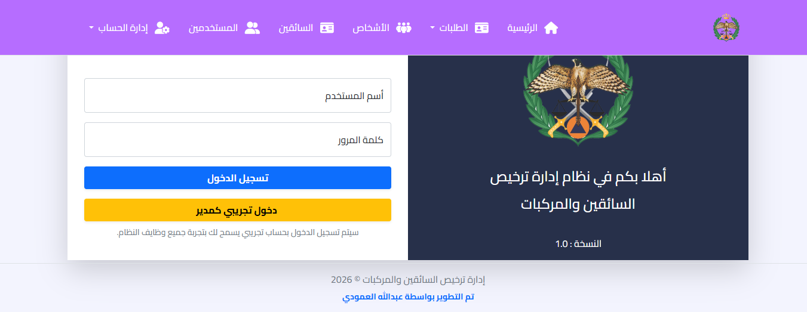
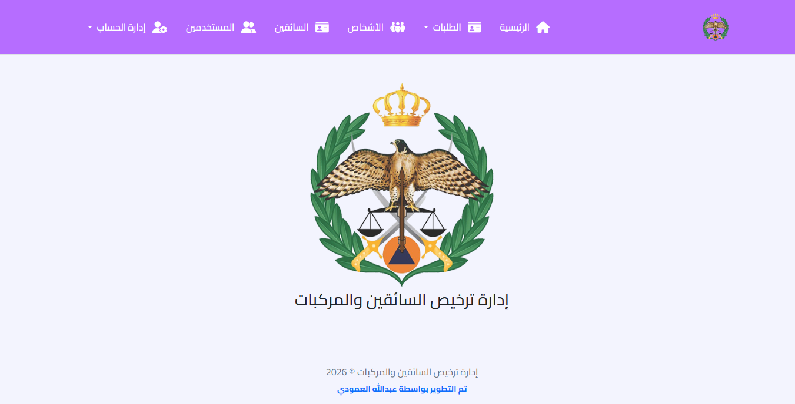
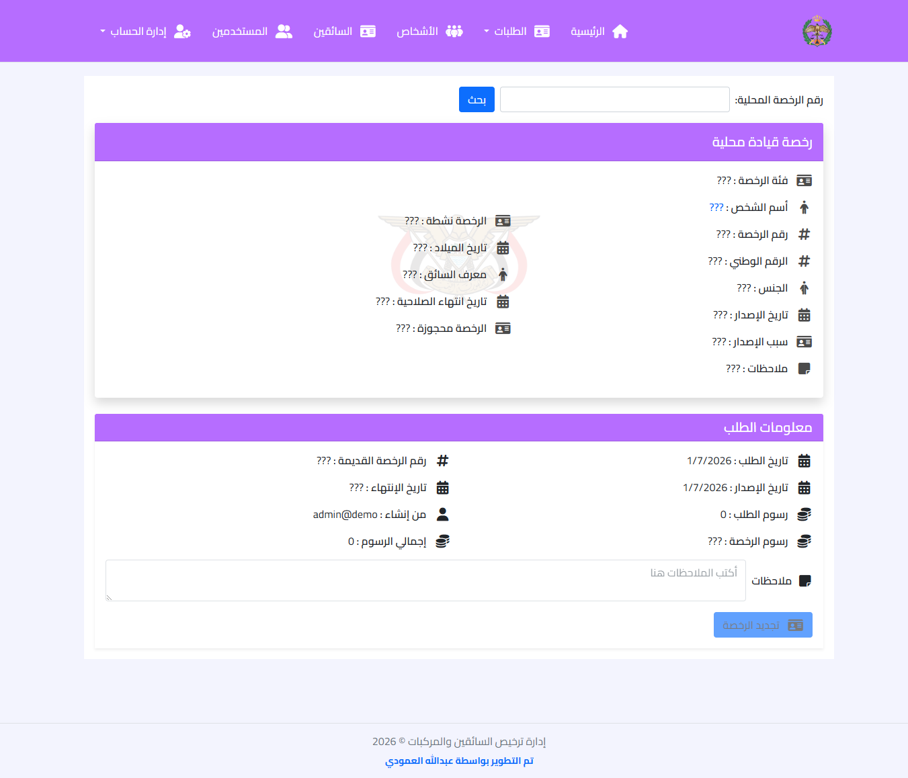
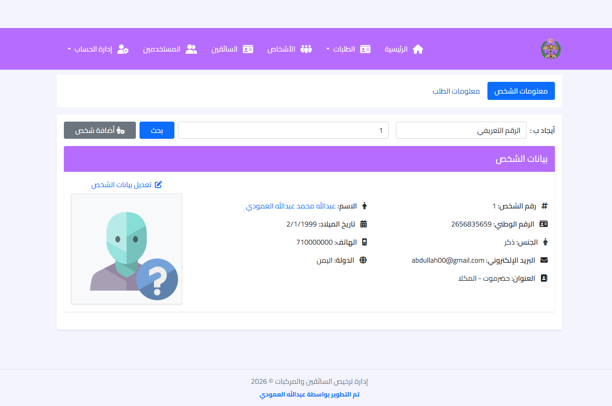
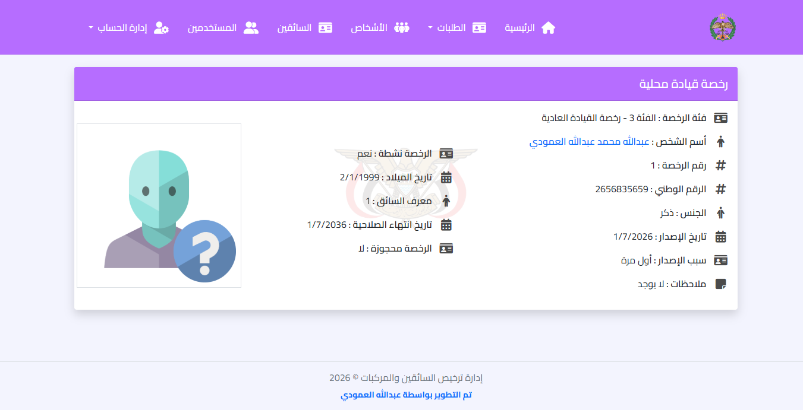

# DVLD System

An ASP.NET Core MVC application** for managing **drivers, licenses, and vehicle-related services**.  
The system supports **license renewal, lost/damaged license replacement, and role-based dashboards** for admins and officers.

---

## 📌 Overview

DVLD System(Driving Vechicle License Department) helps manage drivers and their licenses efficiently, ensuring **proper license validation, renewal, and status tracking**.  
It follows a **clean architecture** with separate layers and **repository pattern**

---

## Features

### Authentication & Authorization
- ASP.NET Core Identity  
- Role-based access: Admin, LicenseOfficer, Examiner, Employee  

### License Management
- Issue Lisense
- Renewal of licenses  
- Replacement for lost or damaged licenses  
- License status tracking (Active, Detained, Expired)  
- Manage detained licenses (detain and release) 

### User Management
- Add and edit user information
- manage users accounts

### Driver Management
- Add and edit driver information  
- Track driver license history  
- Schedule and manage driving tests:
  - Written Test  
  - Street Test  
  - Eye Test

## Technologies Used

- **Backend:** ASP.NET Core MVC  
- **ORM:** Entity Framework Core  
- **Database:** SQL Server  
- **Authentication:** ASP.NET Core Identity  
- **Frontend:** Bootstrap  
- **Architecture:** Repository Pattern + 3-Tier  

---

## 🗂 Project Structure

DVLD/
│── DVLD.sln
│── DVLD.Models
│── DVLD.DataAccess
│── DVLD.Utility
│── DVLDSystem/ ← Presentation Layer
│ ├── Controllers/
│ ├── Views/
│ ├── wwwroot/
│ ├── Areas/
│ ├── Custom/
│ ├── appsettings.json
│ ├── appsettings.Development.json
│ ├── appsettings.Production.json
│ ├── ApplicationDbContextFactory.cs
│ └── Program.cs
│
│── DVLD.Models/ ← Models Class Library
│ ├── ViewModels/
│ └── Models/
│
│── DVLD.DataAccess/ ← Data Access Layer
│ ├── Data/
│ ├── DbInitializer/
│ ├── Repository/
│ └── Migrations/
│
│── DVLD.Utility/ Utility Class Library
│ ├── Settings/
│ ├── SD.cs
│ └── Helpers.cs
│ └── EmailSender.cs
│
│── screenshots/
│── README.md
│── .gitignore

## Screenshots

### Login Page

### Home Page

### License Renewal

### Driver Details

### Filter 

### License Details 

## 🌐 Live Demo

The application is hosted and can be accessed here:  
[DVLD Sysyem Live](https://dvld-portal.runasp.net)

## Author
Abdullah Mohammed Abdullah Alamoudi
ASP.NET Core Developer

Email: abdullah.alamodi99@gmail.com
GitHub: https://github.com/Abdullah-Alamodi99

